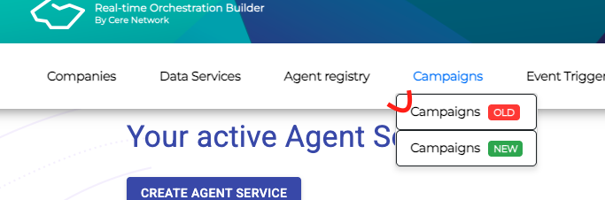
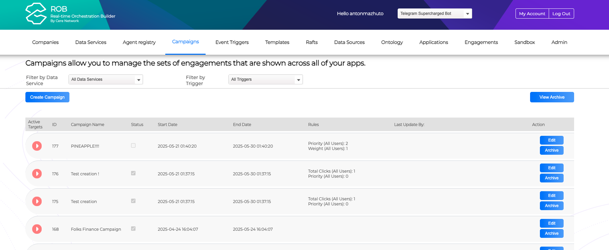
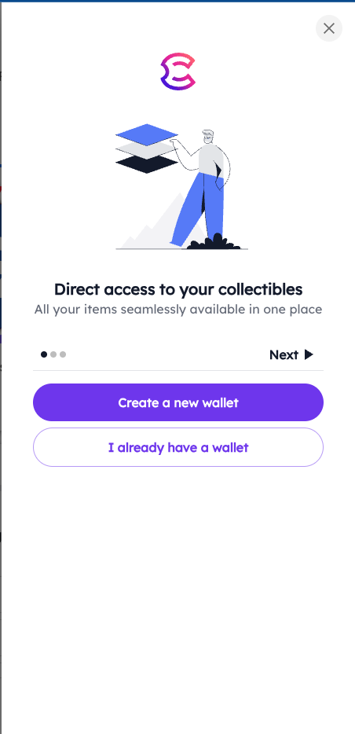
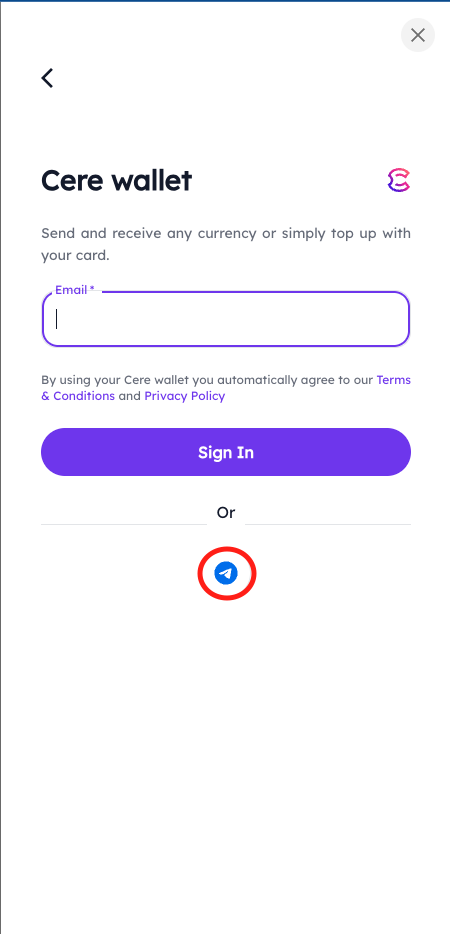

# DDC Streaming Telegram Mini App

Telegram Mini Application that allows users to stream content, use a subscription model to get access to content, and verify NFT ownership.

## How to run

1. Install dependencies:

   ```bash
   npm install
   ```

2. Copy environment variables file:

   ```bash
   cp .env.local .env
   ```

3. Start the app for development:

   ```bash
   npm start
   ```

## Access Campaigns

4. Open the rob admin panel (stage: https://rob.stage.cere.io/EE/admin/login.php, prod: https://rob.cere.io/).

5. Hover over the **Campaigns** tab and choose **Campaigns Old**.  
   

6. You will see a list of available campaigns and their IDs.  
   

7. Find the campaign you need and add its campaignId as a URL parameter to your running app:  
   [http://localhost:5174/?campaignId=168](http://localhost:5174/?campaignId=168)

8. You will see a login window for your wallet. Click **Create a new wallet**, choose login via Telegram, grant all necessary permissions, and start developing.

     
   

## Build for production

9. Run the build command:

   ```bash
   npm run build
   ```

## How to deploy

Merge changes into the `dev` or `master` branch. [These standard CI jobs](https://github.com/cere-io/integration-telegram-app/actions) will deploy the app to the appropriate environment.
